<p align="center">
  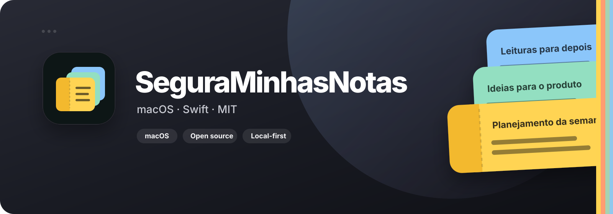
</p>

<p align="center">
  <a href="../README.md">Português do Brasil</a> ·
  <a href="README.en-US.md">English (United States)</a> ·
  <strong>Español (Colombia)</strong>
</p>

<p align="center">
  Una baraja de notas rápidas en el borde del Mac: nativa, local primero, sin cuenta y sin telemetría.
</p>

## Descripción general

**SeguraMinhasNotas** es una aplicación de código abierto para macOS. Mantiene una pequeña pila de colores al costado de la pantalla y ocupa muy poco espacio mientras está en reposo. Al llevar el cursor al borde, la baraja se despliega; con un clic, la tarjeta se convierte en un editor flotante.

La aplicación está construida con Swift, SwiftUI y AppKit, requiere macOS 13 o posterior y no necesita un servidor para crear, editar u organizar notas. El contenido principal permanece en el Mac y, de manera opcional, se puede sincronizar mediante una carpeta elegida por el usuario.

## Recorrido visual

### Primer inicio

<p align="center">
  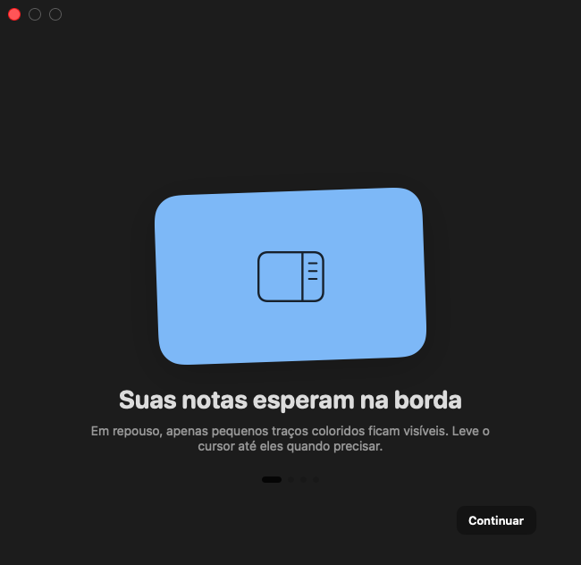
</p>

La introducción explica el gesto del borde, el despliegue de la baraja, el guardado automático y los atajos globales.

### Baraja lateral: en reposo y abierta

| En reposo | Abierta en cascada |
|---|---|
| 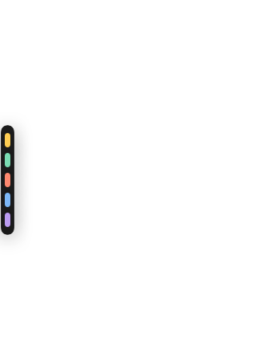 | 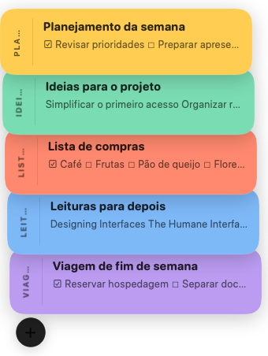 |

- En reposo, cada nota ocupa solamente una pequeña línea de color en el borde.
- La baraja se puede abrir al pasar el cursor o al hacer clic.
- Se muestran directamente hasta ocho tarjetas; las notas adicionales siguen disponibles en la biblioteca.
- Es posible mantener la baraja abierta, cambiar el lado de la pantalla y arrastrar tarjetas para reordenarlas.
- Cada monitor tiene su propio panel y la aplicación puede estar disponible en todos los Spaces y sobre aplicaciones de pantalla completa.

### Editor flotante y listas de verificación

<p align="center">
  
</p>

El editor se puede mover y redimensionar. Incluye título, contenido, etiquetas, listas con casillas interactivas, cinco colores, cuatro estilos de fuente del sistema y tamaño ajustable. Los cambios se guardan 250 ms después de dejar de escribir. Una nota anclada vuelve al escritorio la próxima vez que se abre la aplicación.

### Biblioteca, búsqueda, archivo y exportación

<p align="center">
  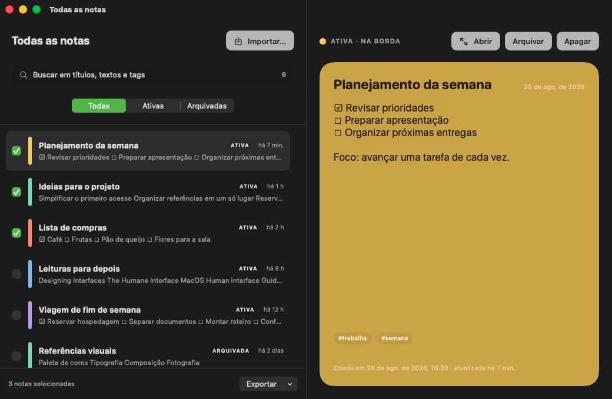
</p>

La ventana **Todas las notas** permite buscar en títulos, contenido y etiquetas; filtrar activas y archivadas; previsualizar; restaurar; deshacer una eliminación durante 10 segundos; importar y exportar en lote.

### Configuración general y apariencia

| General | Apariencia |
|---|---|
| 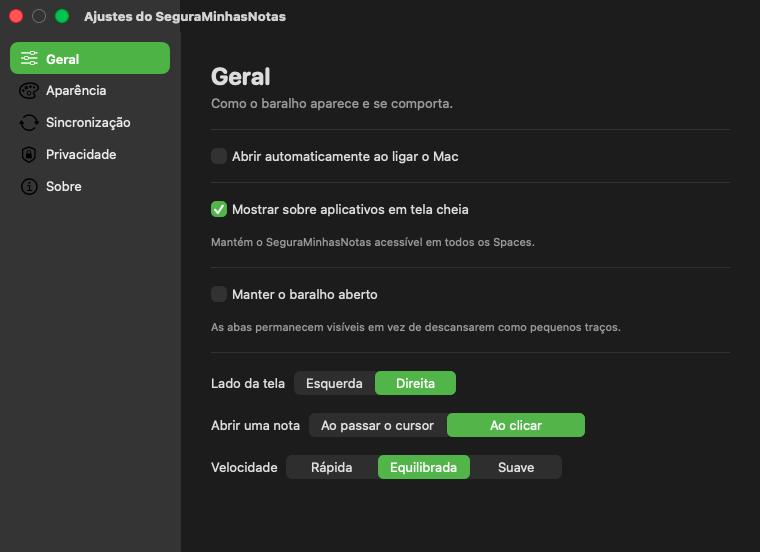 | 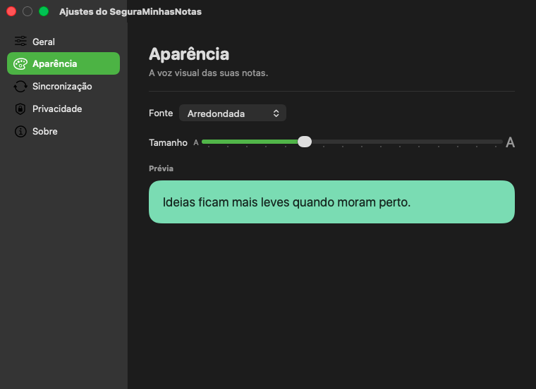 |

**General** controla el inicio automático, el comportamiento sobre pantalla completa, el lado de la pantalla, el gesto de apertura y la velocidad de las animaciones. **Apariencia** permite elegir la fuente y el tamaño con una vista previa inmediata.

### Sincronización y privacidad

| Sincronización | Privacidad |
|---|---|
| 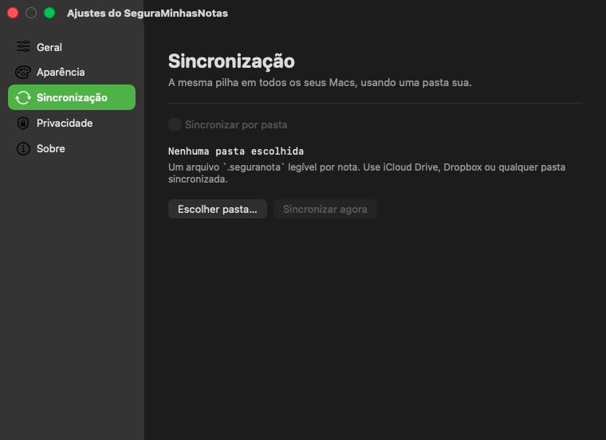 | 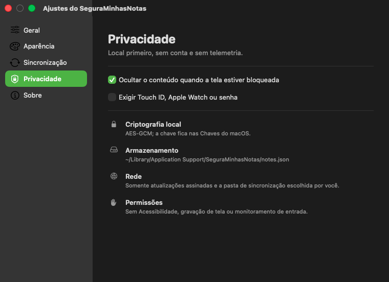 |

La sincronización es opcional y funciona con una carpeta de iCloud Drive, Dropbox u otro proveedor. La página de privacidad explica exactamente qué se cifra, dónde se guarda el archivo local, cuándo se usa la red y cuáles permisos no solicita la aplicación.

### Actualizaciones y contenido protegido

| Información y actualizaciones | Notas bloqueadas |
|---|---|
| 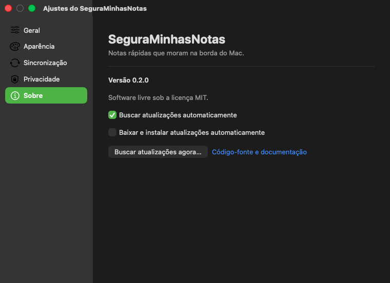 | 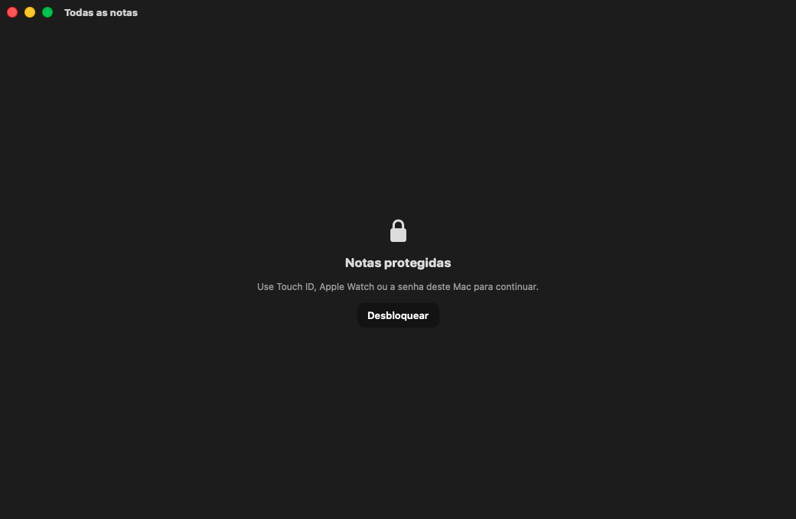 |

El bloqueo opcional usa `LocalAuthentication`: Touch ID, Apple Watch o la contraseña del Mac. La aplicación recibe únicamente el resultado de la autenticación del sistema.

## Funciones disponibles

| Área | Funciones |
|---|---|
| Borde | Panel izquierdo o derecho, uno por monitor, reposo compacto, cascada animada y modo siempre abierto. |
| Notas | Editor flotante, cambio de tamaño, anclaje, guardado automático de 250 ms, título, contenido, etiquetas y cinco colores. |
| Listas | Casillas interactivas, continuación automática al presionar Enter y conversión correcta a Markdown. |
| Organización | Búsqueda que ignora tildes, estados activa/archivada, restauración, reordenamiento y deshacer eliminación. |
| Apariencia | Fuentes redondeada, del sistema, serif y monoespaciada, entre 13 y 28 puntos. |
| Idiomas | Portugués de Brasil, inglés de Estados Unidos y español de Colombia; sigue macOS y permite elegir un idioma solo para la aplicación. |
| Portabilidad | Importación, exportación en lote y archivo completo de respaldo. |
| Sincronización | Un archivo legible por nota en cualquier carpeta sincronizada elegida por el usuario. |
| Privacidad | Cuerpo local cifrado con AES-GCM, clave en Keychain, autenticación opcional y cero telemetría. |
| macOS | Atajos globales, varios monitores, Spaces, pantalla completa, inicio automático y actualizaciones Sparkle. |

## Cómo usarla

1. Abra SeguraMinhasNotas. Funciona como una utilidad y no ocupa espacio permanente en el Dock.
2. Lleve el cursor hasta las pequeñas líneas de colores al costado de la pantalla.
3. Haga clic en una nota para abrir el editor o en `+` para crear otra.
4. Haga clic derecho en la baraja para abrir Todas las notas, el archivo o la configuración.
5. Active **Abrir automáticamente al encender el Mac** si quiere que la baraja esté disponible en cada sesión de macOS.

macOS puede solicitar confirmación en **Configuración del Sistema › General › Ítems de inicio**.

La interfaz sigue la preferencia de idioma de macOS. Para elegir otro idioma solo para SeguraMinhasNotas, abre **Configuración del Sistema › General › Idioma y región › Aplicaciones**, agrega la app y selecciona **Portugués (Brasil)**, **Inglés (EE. UU.)** o **Español (Colombia)**. Cierra y vuelve a abrir SeguraMinhasNotas para aplicar el cambio.

## Atajos de teclado

| Acción | Atajo |
|---|---|
| Nueva nota | `⌥⌘N` |
| Todas las notas | `⌥⌘A` |
| Archivo | `⌥⌘L` |
| Cerrar el editor actual | `⌘W` |

Los atajos se registran mediante APIs nativas de macOS y no requieren permisos de Accesibilidad ni Monitoreo de entrada.

## Importación y exportación

### Exportar

- **Markdown:** un archivo `.md` por nota, conservando las listas.
- **Texto plano:** un archivo `.txt` por nota.
- **Documento único:** todas las notas seleccionadas en un archivo Markdown.
- **Archivo SeguraMinhasNotas:** un paquete `.seguranotas` para respaldo y restauración.
- **Archivo portátil:** el paquete estructurado `.stickies` del proyecto.

### Importar

- archivos `.seguranotas` y `.stickies`;
- Markdown y texto plano;
- archivos RTF y paquetes RTFD exportados por Stickies;
- carpetas que contengan varios archivos compatibles.

## Datos, sincronización y privacidad

El almacenamiento principal se encuentra en:

```text
~/Library/Application Support/SeguraMinhasNotas/notes.json
```

- El **cuerpo** de cada nota se cifra con AES-GCM.
- Una clave aleatoria de 256 bits se guarda en Keychain y no se marca como sincronizable.
- Títulos, etiquetas, colores y metadatos del ciclo de vida permanecen legibles en el contenedor local para indexación y recuperación.
- No hay analytics, telemetría ni reporte de fallos integrado.
- Sparkle usa la red para consultar el canal de actualizaciones. Las notas se sincronizan por la carpeta elegida, no por un servidor del proyecto.
- Los archivos `.seguranota` de la sincronización por carpeta son legibles de forma intencional para facilitar la portabilidad. Use una carpeta con una política de privacidad de confianza.
- El bloqueo puede ocultar todo el contenido cuando la pantalla del Mac está bloqueada y solicitar autenticación local al regresar.

Consulte [SECURITY.md](../SECURITY.md) para conocer el modelo de seguridad y cómo reportar vulnerabilidades.

## Requisitos e instalación

### Requisitos

- macOS 13 Ventura o posterior;
- un Mac Apple Silicon o Intel compatible con la herramienta usada para compilar;
- Swift 6 y las Command Line Tools de Xcode para compilar desde el código fuente.

### Compilar desde el código fuente

```bash
git clone https://github.com/lrqnet/SeguraMinhasNotas.git
cd seguraminhasnotas
./scripts/check.sh
./scripts/build-app.sh
open .build/SeguraMinhasNotas.app
```

La primera compilación descarga Sparkle mediante Swift Package Manager. El paquete local recibe una firma ad hoc apropiada para desarrollo local.

## Arquitectura

| Componente | Implementación |
|---|---|
| Interfaz | SwiftUI para las vistas y AppKit para paneles, ventanas flotantes e integración con macOS. |
| Estado | `NoteStore` observable, operaciones en `MainActor` y persistencia serializada fuera del trabajo de interfaz. |
| Persistencia | Contenedor JSON con cuerpos AES-GCM y una clave guardada en Keychain. |
| Autenticación | `LocalAuthentication` con la política del propietario del dispositivo. |
| Inicio automático | `SMAppService.mainApp`; macOS administra la aprobación y el estado. |
| Actualizaciones | Sparkle 2.9.6; las versiones públicas deben estar firmadas. |
| Distribución | Swift Package Manager, paquete `.app`, firma de Apple y archivo ZIP. |

La aplicación usa `LSUIElement`, por lo que funciona como utilidad en segundo plano sin un ícono permanente en el Dock. El código fuente está en [`Sources/SeguraMinhasNotas`](../Sources/SeguraMinhasNotas).

## Desarrollo y validación

Ejecute las verificaciones locales:

```bash
./scripts/check.sh
./scripts/build-app.sh
codesign --verify --deep --strict --verbose=2 .build/SeguraMinhasNotas.app
```

Lea [CONTRIBUTING.md](../CONTRIBUTING.md) antes de enviar cambios.

## Autoría

Creado y mantenido por [Lucas Quaresma](https://github.com/lrqnet).

## Licencia MIT

Este proyecto es software libre y de código abierto bajo la [licencia MIT](../LICENSE). En la práctica, cualquier persona puede:

- usar el código con fines personales o comerciales;
- copiarlo, modificarlo y combinarlo con otros proyectos;
- publicar y distribuir versiones originales o modificadas;
- sublicenciar o vender copias del software.

La condición principal es conservar el aviso de copyright y el texto de la licencia en las copias o partes sustanciales. El software se entrega **sin garantía**. En otras palabras: sí, puede copiarlo, adaptarlo y construir lo que quiera sobre él, incluso productos comerciales, siempre que mantenga ese aviso.
